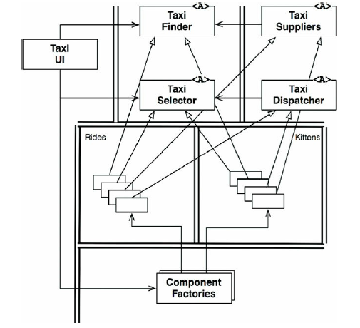
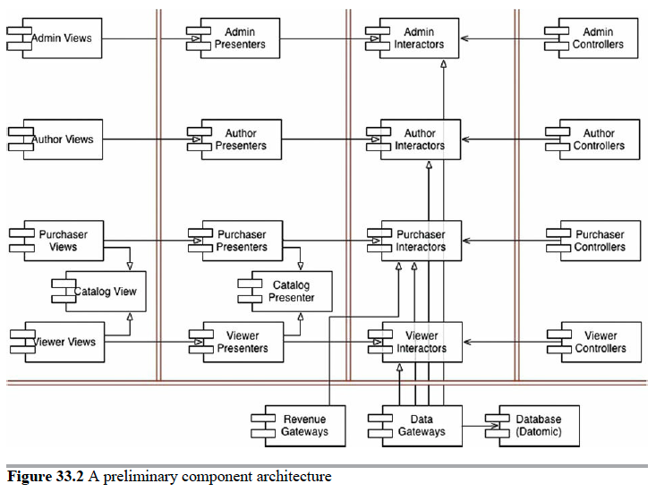

# Video Sales

## Entities & Use Cases

Here, we've defined 4 distinct actors that this application will be responsible to. We've also outlined a handful of key use cases for each. This list is not exhaustive.

- Author
  - Submit Video
  - Submit Exam
  - Submit Video Details/Description
- Purchaser
  - Purchase (Download/Streaming/Business) License
  - View Catalog (as Purchaser)
- Admin
  - Add new Series
  - Publish Video in Series
  - Remove Video from Series
  - Set License Price
- Viewer
  - View Catalog (as Viewer)
  - Stream Video
  - Download Video

Figure 33.1

## Use Case Abstractions

In the figure 33.1, 2 use cases have been abstracted to show some overlap.

- View Catalog
- Purchase License

## Component Architecture

Figure 33.2

> The double lines in the drawing represent architectural boundaries as usual. You can see the typical partitioning of views, presenters, interactors, and controllers. You can also see that I’ve broken each of those categories up by their corresponding actors.

## Dependency Management

> The flow of control in Figure 33.2 proceeds from right to left. Input occurs at the controllers, and that input is processed into a result by the interactors. The presenters then format the results, and the views display those presentations.

> Notice that the using relationships (open arrows) point with the flow of control, and that the inheritance relationships (closed arrows) point against the flow of control. This depicts our use of the Open–Closed Principle to make sure that the dependencies flow in the right direction, and that changes to low-level details do not ripple upward to affect high-level policies.

## Conclusion

> The architecture diagram in Figure 33.2 includes two dimensions of separation. The first is the separation of actors based on the Single Responsibility Principle; the second is the Dependency Rule. The goal of both is to separate components that change for different reasons, and at different rates. The different reasons correspond to the actors; the different rates correspond to the different levels of policy.
