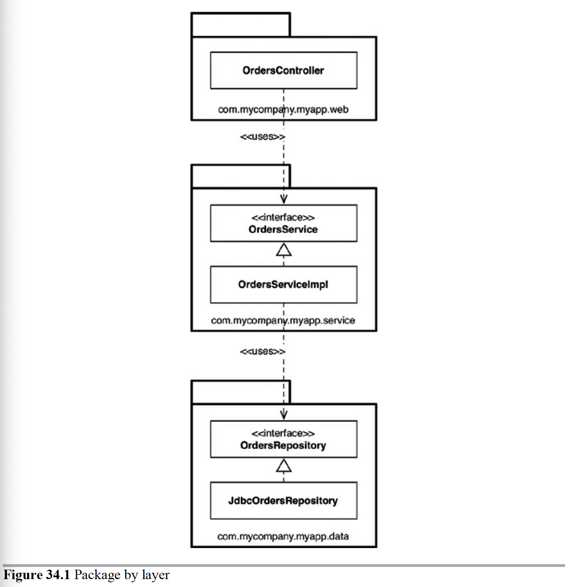
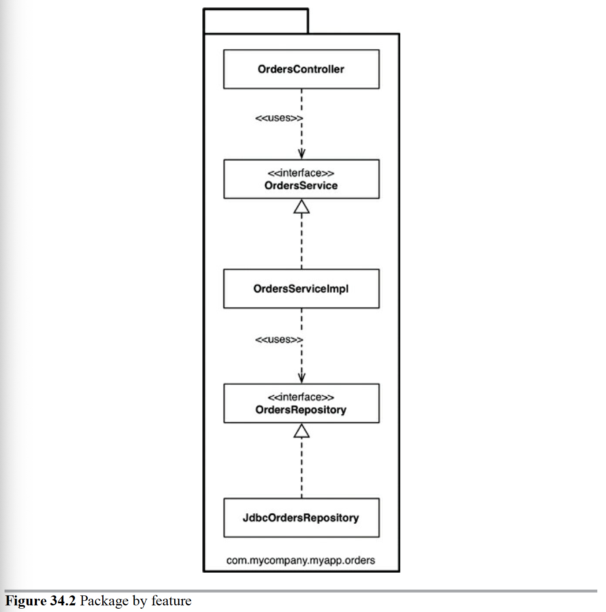
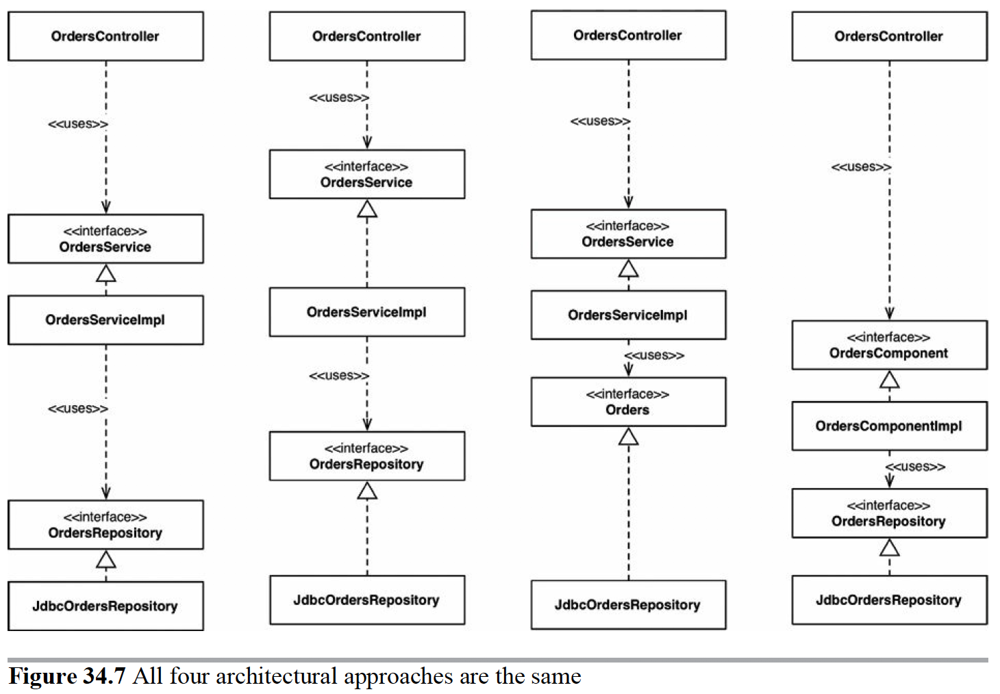
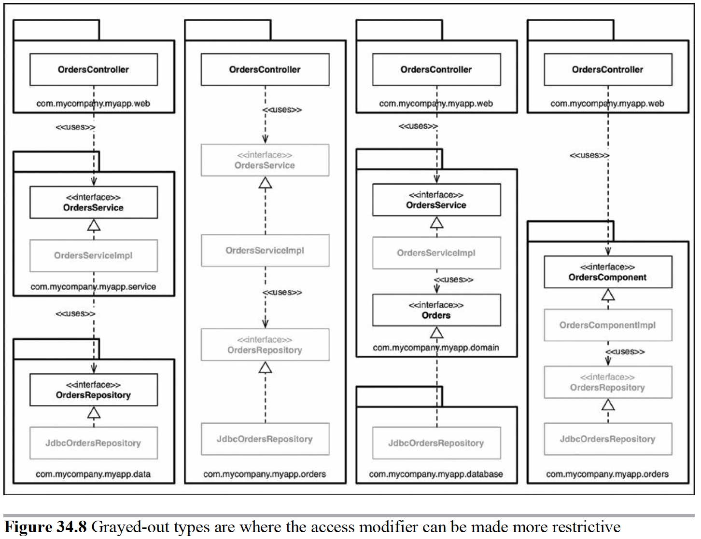

# Chapter 34: The Missing Chapter

The devil is in the implementation details. The author outlines some approaches that could be taken to implement a feature for an online bookstore.

## Package by Layer

This is the horizontal slicing approach looked at in earlier chapters. One layer each for web, "business logic" and persistence. For example, having a controller which uses a Service interface (outlining use cases) that uses a Repository (persistence layer interface) to store and retrieve data.

Figure 34.1

There are a few issues with this. ALthough easy to get running, it can easily become polluted as the application grows in complexity. Also, it doesn't scream anything about the business domains.

## Package by Feature

This is the vertical slicing examples looked at in the book, sliced based on related features or domain concepts. This combines the three horizontal layers into a single package, but keeps all the safe guards of the interfaces to enforce proper flow of control and enforcing our dependency rule.

Figure 34.2

## Ports and Adapters

This is the idea of having architectures where business/domain code ("inside") is independent from technical implementations details ("outside"), like the concentric circle diagram seen in earlier chapters.

The outside layer contain the interactions with the outside works (UI, databases, 3rd party integrations, etc). The outside must always depend on the inside.

In the example here, the author drops the use of the word "Repository" to adhere to "Domain Driven Design" ideas.

## Package by Component

The author outlines some issues with the previous approaches especially in maintaining an acyclic dependency graph and enforcing the dependency rule.

This can be particularly problematic with new developers rolling onto the team where coding standards need to be taught and communicated to the team and enforces either by code review, willpower, or a patchwork of linting and other tools.

If a developer is able to bypass the Orders service and talk directly to the repository (persistence layer) from the controller (I/O) then they've been coupled together. The issue here is about enforcement.

The alternative approach is to "package by component", a hybrid of everything seen so far. It's about taking a service-centric view. In this way, the UI is separate from the coarse grained component. The UI can only interface with Orders through this Orders component which abstracts all of the implementation details away from the UI.

> In essence, this approach bundles up the “business logic” and persistence code into a single thing, which I’m calling a “component.”

> Components are the units of deployment. They are the smallest entities that can be deployed as part of a system.

Or, another way:

> “A grouping of related functionality behind a nice clean interface, which resides inside an execution environment like an application.”

All of the same rules still apply within this component, but now, new features that require manipulating Orders, must go through this component. You can think of well-defined components in a monolithic application as being a stepping stone to a micro-services architecture.

## The Devil is in the Implementation Details

specific to Java in that the use of `public` denotes the opportunity for developers to take shortcuts and by pass the Clean Architecture implemented to gain quick and dirty access to data available in other modules.

> Marking all of your types as public means you’re not taking advantage of the facilities that your programming language provides with regard to encapsulation. In some cases, there’s literally nothing preventing somebody from writing some code to instantiate a concrete implementation class directly, violating the intended architecture style.

## Organization Versus Encapsulation

If everything is `public`, then the packages are just for organization and folder structure, not for encapsulation. The diagrams in this chapters are irrelevant if everything is `public` and accessible anywhere.

The author then shows that all 4 architecture approaches are the same in this fully `public` world.

Figure 34.7

From left to right: "package by layer", "package by feature", ports and adapters, "package by component"

Figure 34.8

You can see the boundaries here.

In the “package by component” approach, the OrdersComponent interface has an inbound dependency from the controller, but everything else can be made package protected.

> This applies to a monolithic application, where all of the code resides in a single source code tree. If you are building such an application (and many people are), I would certainly encourage you to lean on the compiler to enforce your architectural principles, rather than relying on self-discipline and post-compilation tooling.

## Other Decoupling Modes

The author describes features of Java 9's module system to distinguish between truly `public` types and `published` types.

Additionally, these could be in different source code trees. A simple approach that some people follow for their ports and adapters code is to have just two source code trees:

- Domain code (the “inside”)
- Infrastructure code (the “outside”)

Though, the devil is still in the implementation details within each of these code bases.

## Conclusion: The Missing Advice

The whole point of this chapter is to highlight that your best design intentions can be destroyed in a flash if you don’t consider the intricacies of the implementation strategy

Leave options open where applicable, but be pragmatic, and take into consideration the size of your team, their skill level, and the complexity of the solution in conjunction with your time and budgetary constraints.

Also think about using your compiler to help you enforce your chosen architectural style, and watch out for coupling in other areas, such as data models. The devil is in the implementation details.
